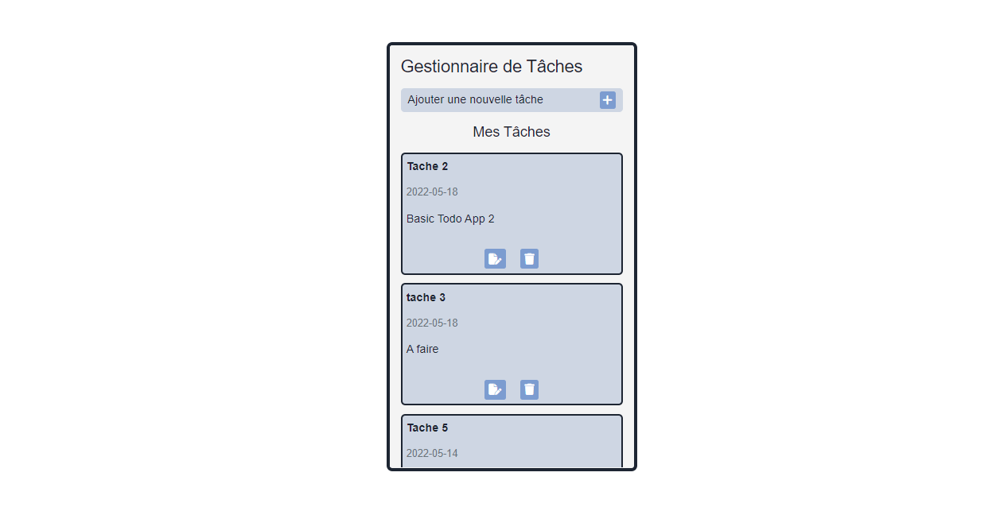
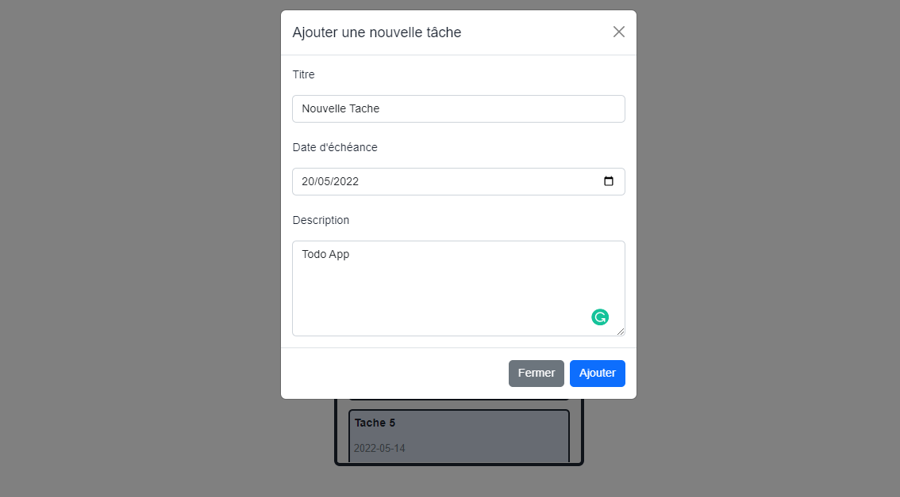
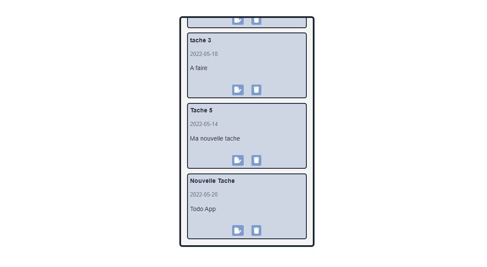

## APPLICATION DE GESTION DE TACHES

 Application de gestion de tache HTML, CSS, LES BASES CRUD EN VANILLA JAVASCRIPT.

Les taches sont stockees au localstorage du naviguateur

<h4>Lien Github Pages de l'application</h4>

